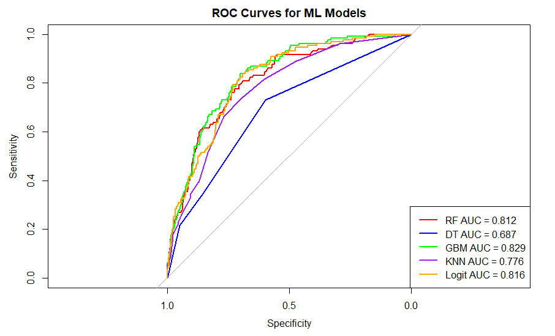

# Diabetes Risk Prediction (NHANES)

This repository contains R code and a thesis report for a project that evaluates multiple machine learning models to predict diabetes risk using NHANES data.

## Project overview
- **Goal:** Predict diabetes risk and identify key risk factors to support early detection.
- **Data:** NHANES (public health survey data; raw data files are not included in this repository).
- **Methods:** Logistic Regression, KNN, Decision Tree, Random Forest, Gradient Boosting.
- **Evaluation:** ROC curve / AUC and accuracy.

## Repository contents
- `Thesis Diabetes code.R` — Data cleaning, model training, and evaluation workflow in R
- `Final Thesis diabetes paper.docx` — Full thesis report (methods, results, discussion)

## Reproducibility
To reproduce the analysis:
1. Download the NHANES XPT files used in the project.
2. Update file paths in `Thesis Diabetes code.R` to point to your local data folder.
3. Run the script in R (common packages used: haven, dplyr/tidyverse, caret, pROC, gbm, randomForest, rpart).

## Visualization

